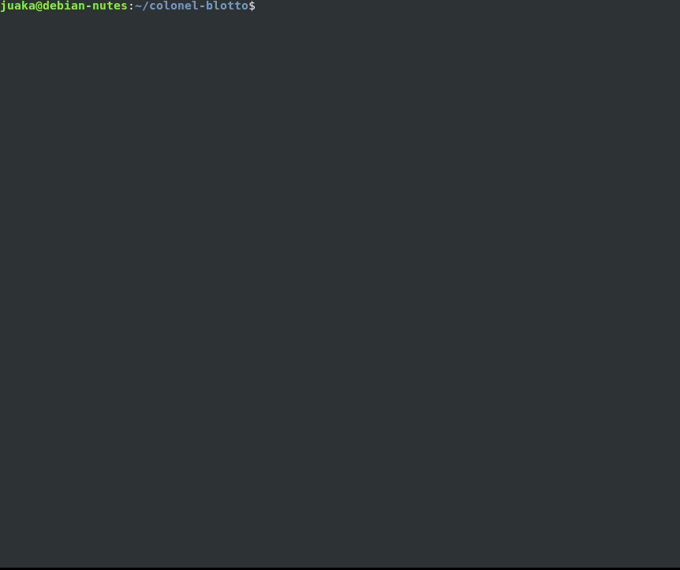

# Colonel Blotto

```
   ___         _                      _     ___   _         _     _         
  / __|  ___  | |  ___   _ _    ___  | |   | _ ) | |  ___  | |_  | |_   ___
 | (__  / _ \ | | / _ \ | ' \  / -_) | |   | _ \ | | / _ \ |  _| |  _| / _ \
  \___| \___/ |_| \___/ |_||_| \___| |_|   |___/ |_| \___/  \__|  \__| \___/
```

[Documentation in portuguese](https://github.com/juakacc/colonel-blotto/blob/master/docs/guide.rst)

A implementation of game Colonel Blotto. Developed with [Haskell](https://www.haskell.org/) and [Brick](https://github.com/jtdaugherty/brick).



## Run

```
$ git clone https://github.com/juakacc/colonel-blotto
$ cd colonel-blotto
$ ./CoronelBlotto
```
Or, download of executable: [Colonel Blotto](https://github.com/juakacc/colonel-blotto/releases/download/v1.1.0/CoronelBlotto)

## Game Theory

Game theory studies the interactions of the players involved in order to choose optimal decisions for each player, according to their particular interests, or not, is widely used in the economic field, among others.

## Colonel Blotto

It is based on a two player game, the player and his opponent, Colonel Blotto, where the two divide their troops between the battlefields in order to lead that field, and thus, getting more leaderships, beat the game. The division of troops is hidden to player.

## More Games of game theory

- [Jogo da velha](https://is.gd/6TUze4)
- [Batalha dos sexos](https://is.gd/p85Wjz)
- [Dilema do prisioneiro](https://is.gd/JOjWO3)
- [Pedra-papel-tesoura](https://is.gd/whZDIV)
- [Cara-coroa](https://is.gd/XiwR6g)
- [Bens públicos](https://is.gd/8a58BE)

## Research

The following study sources were used for implementation:
- [Learn You a Haskell for Great Good](http://learnyouahaskell.com/)
- [Hackage Haskell](https://hackage.haskell.org)
- [Brick API (TUI)](https://github.com/jtdaugherty/brick)

## Credits

Game developed as part of conclusion project of curso computer of University State of Paraíba (UEPB). Implemented in 2019. Utilizing Haskell (A language purely functional) and Brick to development of GUI.

Teacher: Edson Holanda Cavalcante Junior

Student: Joaquim Aníbal Rocha Neto

Follow the GNU General Public License, because i love free software.
:pencil2: with :yellow_heart:
